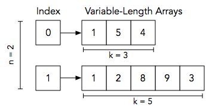

# C++ Variable Sized Arrays

Consider an *n*-element array, *a*, where each index  *i* in the array contains a reference to an array of *k<sub>i</sub>* integers (where the value of *k<sub>i</sub>* varies from array to array). See the Explanation section below for a diagram.

Given *a*, you must answer *q* queries. Each query is in the format `i j`, where *i* denotes an index in array *a* and *j* denotes an index in the array located at *a[i]*. For each query, find and print the value of element *j* in the array at location *a[i]* on a new line.

Click [here](https://cplusplus.com/reference/vector/vector/) to know more about how to create variable sized arrays in C++.

**Input Format**

The first line contains two space-separated integers denoting the respective values of *n* (the number of variable-length arrays) and *q* (the number of queries).
Each line *i* of the *n* subsequent lines contains a space-separated sequence in the format k a[i]<sub>0</sub> a[i]<sub>1</sub> … a[i]<sub>k-1</sub> describing the *k*-element array located at *a[i]*.
Each of the *q* subsequent lines contains two space-separated integers describing the respective values of *i* (an index in array *a*) and *j* (an index in the array referenced by *a[i]*) for a query.

**Output Format**

For each pair of *i* and *j* values (i.e., for each query), print a single integer that denotes the element located at index *j* of the array referenced by *a[i]*. There should be a total of *q* lines of output.

**Example Input**

```
2 2
3 1 5 4
5 1 2 8 9 3
0 1
1 3
```

**Sample Output**

```
5
9
```

**Explanation**

The diagram below depicts our assembled Sample Input:



We perform the following *q = 2* queries:
1. Find the array located at index *i = 0*, which corresponds to *a[0] = [1, 5, 4]*. We must print the value at index *j = 1* of this array which, as you can see, is *5*.
2. Find the array located at index *a[1] = [1, 2, 8, 9, 3]*, which corresponds to . We must print the value at index *j = 3* of this array which, as you can see, is *9*.